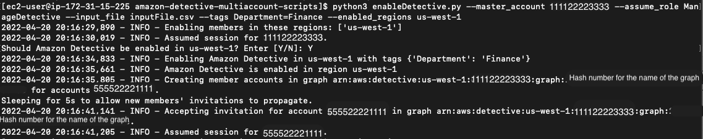

# amazon-detective-multiaccount-scripts

Amazon Detective provides a set of open-source Python scripts in this repository. The scripts require Python 3.

You can use these to perform the following tasks:
* Enable Detective for an administrator account across Regions. When you enable Detective, you can assign tag values to assign to a new behavior graph.
* Add member accounts to an administrator account's behavior graphs across Regions.
* Optionally send invitation emails to the member accounts. You can also configure the request to not send invitation emails.
* Remove member accounts from an administrator account's behavior graphs across Regions.
* Disable Detective for an administrator account across Regions. When an administrator account disables Detective, the administrator account's behavior graph in each Region is disabled.

For more information on how to use these scripts, see [Using the Amazon Detective Python scripts](https://docs.aws.amazon.com/detective/latest/adminguide/detective-github-scripts.html)

## Contributing to this project

### Complete use case

The following is an example use case of adding multiple accounts in a graph.

1. Create a .csv file of the AWS account ids.
    1. (Please check the format in section: *Creating a .csv list of accounts to add or remove*)
2. Add the necessary permissions to each account.
    1. (Please check the complete setup in section: *Required permissions for the scripts*)
3. Add the root module into PYTHONPATH.
    ```
   #For example: export PYTHONPATH=$PYTHONPATH:/my_folder/amazon-detective-multiaccount-scripts/src
    
   export PYTHONPATH=$PYTHONPATH:<absolute root module path> 
    ```
4. Go to the root module, and run the python script and specify the .csv file. Make sure the role specified by --assume_role is the one created in Step 2. 
    ```
   #For example:
   cd /my_folder/amazon-detective-multiaccount-scripts/src/amazon_detective_multiaccount_scripts
   python3 enableDetective.py --admin_account 111122223333 --assume_role ManageDetective --input_file inputFile.csv --tags Department=Finance --enabled_regions us-west-1
   ```
6. Check results of the script in the terminal and/or AWS console.
    1. For example, for the command above, the terminal should have the following output:
       
       

### Running tests

```
# Install requirements

pip3 install boto3 pytest

# In the tests/ directory...

# Add your root module into PYTHONPATH (if you haven't done this step) 
# eg: export PYTHONPATH=$PYTHONPATH:/my_folder/amazon-detective-multiaccount-scripts/src

export PYTHONPATH=$PYTHONPATH:<absolute root module path> 

# Run the test

pytest -s
```

## FAQs
1. If you experience the following error Message for opt-in regions while enabling detective in all regions:

    `ERROR - error with region <region>: An error occurred (UnrecognizedClientException) when calling the ListGraphs operation:
The security token included in the request is invalid`

    Using the scripts in opt-in regions assumes you have your accounts/resources configured in that region, so please double-check your accounts' configuration.

    For further information, here is documentation on opt-in regions work: https://docs.aws.amazon.com/general/latest/gr/rande-manage.html.
